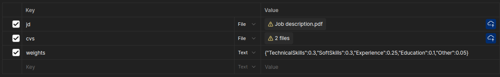

# Resume Analyzing

A simple Python project to test calling the OpenRouter API using the official OpenAI library. It also includes a Streamlit web app to analyze CVs (PDF) and display extracted information as JSON.

## Project Structure

```
ai/
├── src/
│   ├── api.py                # fast api
│   ├── ExtractLLM.py         # using LLM to extract information from CV or JD
│   ├── ExtractText.py        # Extract text from PDF files
│   ├── LangchainClient.py    # Call LLM API
│   └── Scoring.py            # Scoring for CV by customed weights
├── tests/               # Test directory 
├── requirements.txt     # Python dependencies
└── README.md            # This file
```

## Setup Instructions

### 1. Install Dependencies

```bash
pip install -r requirements.txt
```

### 2. Get LLM API Key

Copy your API key in to .env file

### 5. Run the fastapi application

```bash
cd src
uvicorn api:app --reload --host 0.0.0.0 --port 8000
```

Then send to this url http://127.0.0.1:8000/match/multiple with the body:



