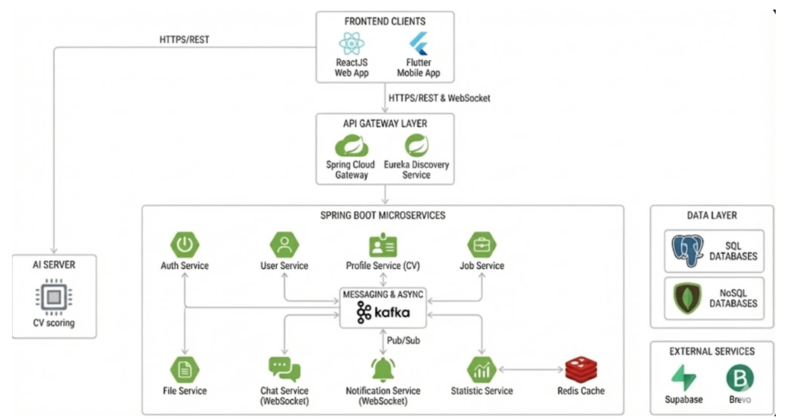

# 🚀 IT Job Hunt - Microservices Backend System

> **Hệ thống Backend Microservices nền tảng tìm kiếm việc làm IT, kết nối Nhà tuyển dụng và Ứng viên với khả năng chịu tải cao và xử lý bất đồng bộ.**

---

## 📖 Giới thiệu (Introduction)

**IT Job Hunt** là nền tảng tuyển dụng chuyên biệt cho ngành CNTT. Dự án được xây dựng dựa trên kiến trúc **Microservices**, tập trung giải quyết bài toán về khả năng mở rộng (scalability), hiệu năng xử lý dữ liệu lớn và giao tiếp thời gian thực (Real-time communication).

Dự án không chỉ cung cấp các API CRUD cơ bản mà còn tích hợp các giải pháp kỹ thuật nâng cao như **Event-Driven Architecture (Kafka)**, **Caching (Redis)** và **Cloud Deployment (Azure)**.

---

## 🏗 Kiến trúc hệ thống (System Architecture)

Hệ thống được chia nhỏ thành các services độc lập, giao tiếp thông qua RESTful API và Message Broker.

* **Discovery Server:** Netflix Eureka.
* **API Gateway:** Spring Cloud Gateway (Entry point duy nhất của hệ thống).
* **Inter-service Communication:** OpenFeign (Sync) & Kafka (Async).
* **Deployment:** Azure Container Apps.

*(Lưu ý: Bạn hãy thay thế link ảnh trên bằng sơ đồ kiến trúc thực tế của bạn)*

---

## 🛠 Công nghệ sử dụng (Tech Stack)

### Core & Frameworks
* **Language:** Java JDK 17
* **Framework:** Spring Boot 3.5.x, Spring Cloud
* **Security:** Spring Security, JWT (Stateless Authentication), OAuth2 (Google)

### Database & Storage
* **RDBMS:** PostgreSQL (Quản lý dữ liệu có cấu trúc: Users, Jobs, Applications)
* **NoSQL:** MongoDB (Lưu trữ dữ liệu phi cấu trúc/Logs - *nếu có dùng cho chat/log*)
* **Cloud Storage:** Supabase Storage (Lưu trữ CV, Avatar)

### Performance & Messaging
* **Caching:** Redis (Cache statistical data, giảm tải cho Database)
* **Message Queue:** Apache Kafka (Xử lý tác vụ thống kê bất đồng bộ, Decoupling services)
* **Real-time:** WebSocket (Chat ứng viên - nhà tuyển dụng, Thông báo đẩy)

### DevOps & Tools
* **Containerization:** Docker
* **Cloud Platform:** Microsoft Azure (Azure Container Apps)
* **API Documentation:** Swagger / OpenAPI
* **Utils:** Lombok, ModelMapper, Brevo (Email Service)

---

## 💡 Điểm nhấn kỹ thuật (Technical Highlights)

Đây là những thách thức kỹ thuật tôi đã giải quyết trong dự án này:

### 1. Tối ưu hiệu năng với Event-Driven Architecture (Kafka)
* **Vấn đề:** Việc gọi API đồng bộ (Synchronous) qua Feign Client để cập nhật số liệu thống kê mỗi khi có hành động (view job, apply job) làm tăng độ trễ (latency) của User experience.
* **Giải pháp:** Chuyển sang mô hình **Bất đồng bộ (Asynchronous)** sử dụng **Apache Kafka**. Khi User tương tác, hệ thống bắn một event vào topic, service Thống kê sẽ consume event đó và xử lý ngầm.
* **Kết quả:** Giảm thời gian phản hồi API chính, tách biệt (decouple) logic nghiệp vụ và logic thống kê.

### 2. High Performance Caching (Redis)
* **Vấn đề:** Các API Dashboard/Thống kê bị gọi liên tục gây áp lực lớn lên Database.
* **Giải pháp:** Triển khai **Redis** để cache kết quả các query nặng. Dữ liệu chỉ được tính toán lại khi có sự thay đổi hoặc hết TTL (Time-to-live).

### 3. Real-time Communication (WebSocket)
* Xây dựng module Chat và Notification sử dụng giao thức WebSocket, cho phép Nhà tuyển dụng và Ứng viên trao đổi ngay lập tức mà không cần reload trang.

### 4. Cloud Native Deployment
* Toàn bộ hệ thống được đóng gói (Containerized) bằng Docker và deploy lên **Azure Container Apps**, đảm bảo môi trường Dev và Production đồng nhất.

---

## 🔌 API Documentation

Hệ thống cung cấp RESTful APIs và WebSocket endpoints được phân chia theo từng Microservice. Dưới đây là danh sách các resource chính:

### 1. Identity & Access Management
* **Auth Service:**
    * `/api/auth/**` (Login, Register, Refresh Token, Logout)
* **User Service:**
    * `/api/users/**` (Quản lý thông tin User cơ bản)

### 2. Core Business Services
* **Job Service:**
    * `/api/jobs/**` (Đăng tin, tìm kiếm việc làm)
    * `/api/companies/**` (Thông tin công ty)
    * `/api/applications/**` (Nộp đơn, quản lý CV ứng tuyển)
* **Profile Service:**
    * `/api/profiles/**` (Hồ sơ năng lực ứng viên)
    * `/api/skills/**` (Danh sách kỹ năng)
    * `/api/categories/**` (Danh mục ngành nghề)

### 3. Communication & Real-time
* **Chat Service:**
    * `/api/conversations/**` (Quản lý các cuộc hội thoại)
    * `/api/messages/**` (Lịch sử tin nhắn)
    * `ws://{server}/ws-chat` (WebSocket endpoint cho chat)
* **Notification Service:**
    * `/api/notifications/**` (Danh sách thông báo, đánh dấu đã đọc)
    * `ws://{server}/ws` (WebSocket endpoint nhận thông báo đẩy)

### 4. Data Analytics & Insights (Statistic Service)
* **Base URL:** `/api/statistics`
* **Features:** Cung cấp số liệu phân tích thị trường lao động (có sử dụng **Redis Caching** để tối ưu tốc độ phản hồi).
    * `GET /summary`: Tổng quan số liệu toàn hệ thống.
    * `GET /experience`: Phân bố việc làm theo cấp bậc kinh nghiệm (Junior, Senior, etc.).
    * `GET /top-skills?limit=10`: Top những kỹ năng được yêu cầu nhiều nhất (Trending Tech Stack).
    * `GET /salary`: Phân tích dải lương trung bình theo ngành nghề.
    * `GET /growth?days=7`: Biểu đồ tăng trưởng số lượng Job/User theo thời gian (mặc định 7 ngày).
    * `GET /locations`: Bản đồ phân bố việc làm theo địa lý.

> **Lưu ý:** Tất cả các API đều đi qua **API Gateway** và yêu cầu Access Token (trừ các public endpoints như Xem Job, Login, Register).

---
